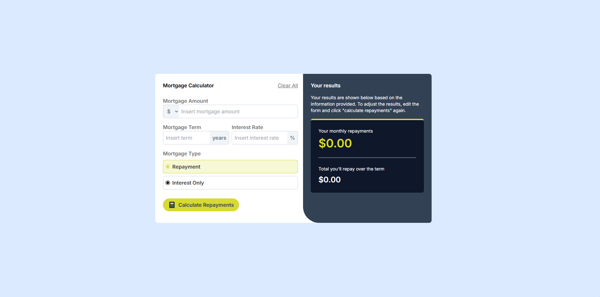
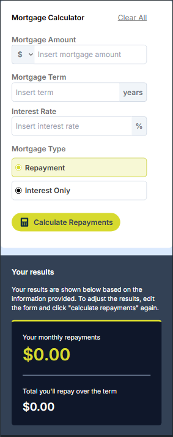

# Frontend Mentor - Mortgage repayment calculator solution

This is a solution to the [Mortgage repayment calculator challenge on Frontend Mentor](https://www.frontendmentor.io/challenges/mortgage-repayment-calculator-Galx1LXK73). Frontend Mentor challenges help you improve your coding skills by building realistic projects.

## Table of contents

- [Overview](#overview)
  - [The challenge](#the-challenge)
  - [Screenshot](#screenshot)
  - [Links](#links)
- [My process](#my-process)
  - [Built with](#built-with)
  - [What I learned](#what-i-learned)
  - [Continued development](#continued-development)
- [Author](#author)

## Overview

### The challenge

Users should be able to:

- Input mortgage information and see monthly repayment and total repayment amounts after submitting the form
- See form validation messages if any field is incomplete
- Complete the form only using their keyboard
- View the optimal layout for the interface depending on their device's screen size
- See hover and focus states for all interactive elements on the page

### Screenshot

#### Desktop



#### Mobile



### Links

- Solution URL: [https://github.com/caiobukvar/frontend-mentor-challenges/tree/main/mortgage-calculator](https://github.com/caiobukvar/frontend-mentor-challenges/tree/main/mortgage-calculator)
- Live Site URL: [https://mortgage-calculator-challenge-taupe.vercel.app/](https://mortgage-calculator-challenge-taupe.vercel.app/)

## My process

### Built with

- Semantic HTML5 markup
- TailwindCSS
- Flexbox
- Mobile-first workflow
- [React](https://reactjs.org/) - JS library
- [Next.js](https://nextjs.org/) - React framework

**Note: These are just examples. Delete this note and replace the list above with your own choices**

### What I learned

TailwindCSS's **peer** and **peer-focus** to make creative elements that unite while on focus, so we can easily customize it's behavior.

```html
<label
  htmlFor="mortgage_rate"
  className="flex flex-col text-neutral-500 font-semibold flex-1"
>
  Interest Rate
  <div className="flex relative">
    <input type="number" name="rate" id="mortgage_rate" placeholder="Insert
    interest rate" onChange={handleInputChange} className={`peer
    border-slate-300 border-[1px] rounded-md p-2 w-full placeholder:font-normal
    pr-10 focus:outline-none focus:ring-2 focus:ring-slate-700 ${ errors.rate ?
    "border-red-500" : "" }`} />
    <span
      className="absolute right-0 top-1/2 transform -translate-y-1/2
        text-gray-500 bg-slate-100 h-full p-2 border border-slate-300
        border-l-0 rounded-r-md
        peer-focus:ring-2 peer-focus:ring-slate-700"
    >
      %
    </span>
  </div>
  {errors.rate &&
  <p className="text-red-500 text-sm">{errors.rate}</p>
  }
</label>
```

As from the snippet above, while using **_peer_** as classname for an element, we are able to use **_peer-focus_** so the element tracks when the input is focused, applying styles based on it's focus state.

### Continued development

Eager to build more overlapping HTML elements with quality on the projects to be developed.

## Author

- Website - [Caio Bukvar](https://bkvr.dev.br/pt)
- Frontend Mentor - [@caiobukvar](https://www.frontendmentor.io/profile/caiobukvar)
